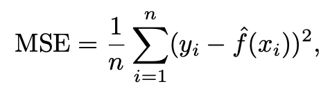

# Measuring the Quality of Fit

In the regression setting, the most commonly-used measure is the **mean squared error (MSE)**, given by

where `f_hat(xi)`1 is the prediction that `f_hat` gives for the *i*th observation. The MSE above is computed using the training data and should more accurately be referred to as the **training MSE**.