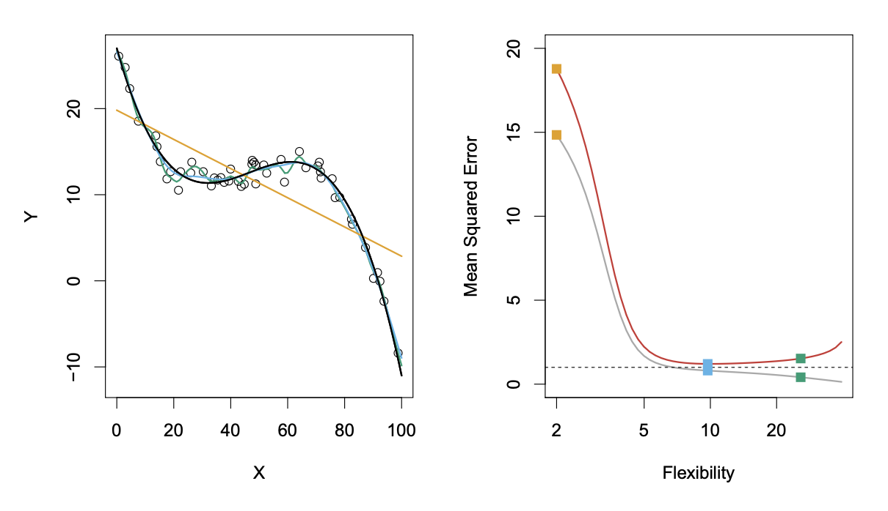
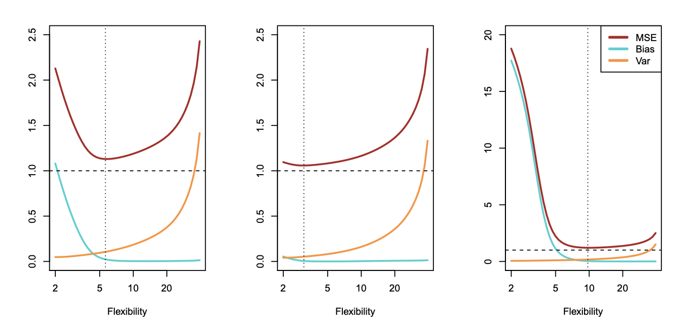

# Measuring the Quality of Fit

In the regression setting, the most commonly-used measure is the **mean squared error (MSE)**, given by

where `f_hat(xi)`1 is the prediction that `f_hat` gives for the *i*th observation. The MSE above is computed using the training data and should more accurately be referred to as the **training MSE**. We don't care much about how well the method works on the training data. Rather, **we are interested in the accuracy of the predictions that we obtain when we apply our method to previously unseen test data**. 

# The Bias-Variance Trade-Off

The U-shape observed in the test MSE (shown below) turns out to be the result of the bias-variance trade-off.

It's possible to show (but we're not going to) that the expected test MSE, for a given value x0, can always be decomposed into the sum of three fundamental quantities: the **variance, the squared bias, and the variance of error terms**.

This effectively tells us that in order to minimize the expected test error, we need to select a statistical learning method that simultaneously achieves **low variance and low bias**. Note that variance and squared bias are inherently a nonnegative quantities. 

**Variance** refers to the amount by which f hat would chance if we estimated it using a different training data set. Ideally, the estimate for f should not vary too much between training sets. However, if a method has a high variance, then small changes in the training data can result in large changes in f hat. In general, **more flexible statistical methods have higher variance**.

Consider the following:

The flexible green curve is following the observations very closely. It has high variance because changing one of these data points may cause the estimate to change considerably. In contrast, the least squares line is relatively inflexible and has low variance, because moving any single observation will likely cause only a small shift in the position of the line.

On the other hand, **bias** refers to the error that's introduced by approximating a real-life problem, which may be extremely complicated, by a much simpler model. For example, linear regression assumes that there is a linear relationship. It's unlikely that any real-life problem truly has such a simple linear relationship, and so performing linear regression will undoubtedly result in some bias in the estimate of f.

As a general rule, as we use more flexible methods, the variance will increase and the bias will decrease. Don't forget that **flexibility refers to a model's "curvy-ness" when graphing the model equation**. This comes with the assumption that the model is an adequate representation of the training data.

However, **at some point increasing flexibility has little impact on the bias but starts to significantly increase the variance**. When this happens the test MSE increases.