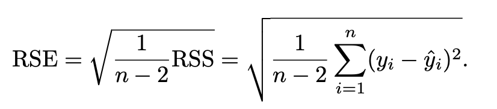
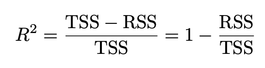
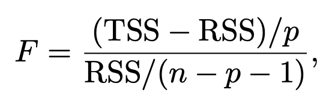

# Measuring the Quality of Fit

In the regression setting, the most commonly-used measure is the **mean squared error (MSE)**, given by

where `f_hat(xi)`1 is the prediction that `f_hat` gives for the *i*th observation. The MSE above is computed using the training data and should more accurately be referred to as the **training MSE**. We don't care much about how well the method works on the training data. Rather, **we are interested in the accuracy of the predictions that we obtain when we apply our method to previously unseen test data**. 

# The Bias-Variance Trade-Off

The U-shape observed in the test MSE (shown below) turns out to be the result of the bias-variance trade-off.

It's possible to show (but we're not going to) that the expected test MSE, for a given value x0, can always be decomposed into the sum of three fundamental quantities: the **variance, the squared bias, and the variance of error terms**.

This effectively tells us that in order to minimize the expected test error, we need to select a statistical learning method that simultaneously achieves **low variance and low bias**. Note that variance and squared bias are inherently a nonnegative quantities. 

**Variance** refers to the amount by which f hat would chance if we estimated it using a different training data set. Ideally, the estimate for f should not vary too much between training sets. However, if a method has a high variance, then small changes in the training data can result in large changes in f hat. In general, **more flexible statistical methods have higher variance**.

Consider the following:

The flexible green curve is following the observations very closely. It has high variance because changing one of these data points may cause the estimate to change considerably. In contrast, the least squares line is relatively inflexible and has low variance, because moving any single observation will likely cause only a small shift in the position of the line.

On the other hand, **bias** refers to the error that's introduced by approximating a real-life problem, which may be extremely complicated, by a much simpler model. For example, linear regression assumes that there is a linear relationship. It's unlikely that any real-life problem truly has such a simple linear relationship, and so performing linear regression will undoubtedly result in some bias in the estimate of f.

As a general rule, as we use more flexible methods, the variance will increase and the bias will decrease. Don't forget that **flexibility refers to a model's "curvy-ness" when graphing the model equation**. This comes with the assumption that the model is an adequate representation of the training data.

However, **at some point increasing flexibility has little impact on the bias but starts to significantly increase the variance**. When this happens the test MSE increases.

# Linear Regression Statistical Measurements

## Residual Sum of Squares (RSS)

You're already very familiar with this. It's simply the sum of the difference of all residuals resulting from the model. Let's move on.

## Standard Error (SE)

Following an analogy of the estimation of the population mean µ of a random variable Y. A natural question is as follows: how accurate is the sample mean µ hat as an estimate of µ? The average of µ hats over many data sets will be very close to µ, but a single estimate of µ hate may be a substantial under or overestimate of µ. How far off will that single estimate of µ hat be? In general, we answer this question by computing the **standard error of µ hat**. We have the formula

Roughly speaking, the **standard error tells us the average amount that the estimate µ hat differs from the actual value of µ. The above equation tells us that this deviation shrinks with *n* - the more observations we have, the smaller the SE of µ hat**. We can use similar methods for estimating beta hat 0 and 1.

## Residual Standard Error (RSE)

Same thing as SE, just concerning the residuals. For the RSE formulas to be strictly valid, **we need to assume that the errors for each observation have common variance (SD^2) and are uncorrelated**. This estimate of SD is given by the formula

**Standard errors are used to compute confidence intervals**. A 95% confidence interval is defined as a range of values such that with 95% probability, the range will contain the true unknown value of the parameter. The range is defined in terms of lower and upper limits computed from the sample of data.

A 95% confidence interval has the following property: if we take repeated samples and construct the confidence interval for each sample, 95% of the intervals will contain the true unknown value of the parameter.

**Standard errors can also be used to perform hypothesis tests on the coefficients**. The most common hypothesis test involves testing the **null hypothesis of

H0: There is no relationship between X and Y

versus the alternative hypothesis

Ha: There is some relationship between X and Y.

Mathematically, this corresponds to testing

## t-statistic

The t-statistic is used in a **T test** when you are deciding if you should **support or reject the n=ull hypothesis**. There is no single formula for it, but here's the one the textbook uses

which measures the number of standard deviations that beta hat1 isd away from 0. If there really is no relationship between X and Y, then we expect that the above formula will have a t-distribution with n-2 degrees of freedom. The t-distribution has a bell shape and **for values of n greater than approximately 30 it's quite similar to the standard normal distribution**. Consequently, it's a simple matter to compute the probability of observing any number equal to the absolute value of t or larger in absolute value, assuming beta1 = 0. We call this probability the **p-value**.

Roughly speaking, we interpret the p-value as follows: **a small p-value indicates that it's unlikely to observe such a substantial association between the predictor and the response due to chance**, in the absence of any real association between the predictor and the response. Hence, if we see a small p-value, then we can infer that there is an association between the predictor and the response. **We reject the null hypothesis** - that is, we declare a relationship to exist between X and Y - if the p-value is small enough. Typical p-value cutoffs for rejecting the null hypothesis are 5% or 1%. **When n = 30**, these correspond to t-statistics of around 2 and 2.75, respectively.

Watch [this video](https://www.youtube.com/watch?v=2ARvj-8tJBs&t=176s) for a better understanding.

**Summary**
* A t-test (1) assumes the null hypothesis is true and then (2) evaluates whether that is a bad assumption.
* The p value tells us the probability that the two datasets would have differed due to random chance under the assumption of the null hypothesis.
* If p < 0.05 (generally speaking), you can reject the null hypothesis. This corresponds to a "95% confidence interval."
* A t-test can be paired (you tested the same group twice) or unpaired (you tested two different groups).

# Assessing the Accuracy of the Model

Once we have rejected the null hypothesis, it's natural to quantify **the extent to which the model fits the data**. The quality of a linear regression fit is typically assessed using two related quantities: the **residual standard error (RSE)** and the **R^2 statistic**.

## Residual Standard Error

Recall that a model has error terms associated with each observation. Due to the presence of these error terms, even if we knew the true regression line, we would not be able to perfectly predict Y from X. **The RSE is an estimate of the standard deviation of the error term**. Roughly speaking, **it's the average amount that the response will deviate from the true regression line**. It's computed using the formula

The ∑ part of the formula is the RSS formula that was defined earlier. [Here's a good thread on why that strange subtraction of 2 is in the formula](https://www.reddit.com/r/statistics/comments/1nlsd7/can_someone_explain_why_were_always_using_terms/).

**The RSE is considered a measure of the lack of fit of the model to the data**. If the predictions obtained using the model are very close to the true outcome values, then the RSE will be small, and we can conclude that the model fits the data well.

## R^2 Statistic

The RSE provides an absolute measure of lack of fit of the model to the data. But since it's measured in units of Y, it's not always clear what constitutes a good RSE. The R^2 statistic provides an alternative measure of fit. It takes the form of a **proportion - the proportion of variance explained** - and so it always takes on a value between 0 and 1, and is **independent of the scale of Y**.

Here's the formula:

**TSS is the total sum of squares, and measures the total variance in the response Y, and can be thought of as the amount of variability inherent in the response before the regression is performed. In contrast, RSS measures the amount of variability that is left unexplained after performing the regression. Hence, TSS - RSS measures the amount of variability in the response that is explained (or removed) by performing the regression, and R^2 measures the proportion of variability in Y that can be explained using X.**

The R^2 statistic has an interpretational advantage over the RSE, since unlike the RSE, it always lies between 0 and 1. However, it can still be challenging what is a *good* R^2 value, and in general this will depend on the application.

# F-statistic

[Watch this video](https://www.youtube.com/watch?v=ie-MYQp1Nic&t=10s)

In a multiple regression setting with *p* predictors, we need to ask whether all of the regression coefficients are zero. As in the simple linear regression setting, we use a hypothesis test to answer this question. **This hypothesis test is performed by computing the F-statistic**

If the alternative hypothesis is true, then we expect F to be greater than 1. A large F statistic suggests that at least one of the features must be related to the target. However, what if the F-statistic had been closer to 1? How large does the F-statistic need to be before we can reject the null hypothesis and conclude that there is a relationship? It turns out that the answer **depends on the values of n and p**. When n is large, an F-statistic that is just a little larger than 1 might still provide evidence against the null. In contrast, a larger F-statistic is needed to reject the null if n is small.

When the null hypothesis is true, and the errors have a normal distribution, the F-statistic follows an **F-distribution**. For any given value of n and p, any statistical software package can be used to compute the p-value associated with the F-statistic using this distribution. Based on this p-value, we can determine whether or not the reject H0.

# Linear Model Selection and Regularization

There are many alternatives to using least squares to fit. Here are the three we will be discussing:
* **Subset Selection:** Involves identifying a subset of the *p* predictors that we believe to be related to the response. We then fit a model using least squares on the reduced set of variables.
* **Shrinkage:** Involves fitting a model on all *p* predictors. However, the estimated coefficients are shrunken towards zero relative to the least squares estimated. This is **regularization**, and has the effect of reducing variance.
* **Dimension Reduction:** Involves **projecting** the *p* predictors into an *M*-dimensional subspace, where *M* < *p*. This is achieved by computing *M* different linear combinations, or projections, of the variables. These projections are used as predictors to fit a linear regression model by least squares (such as PCA).

**AIC and BIC start on page 244. I'm just gonna spend time reading directly from the textbook instead of making notes since this is taking up too much time.**