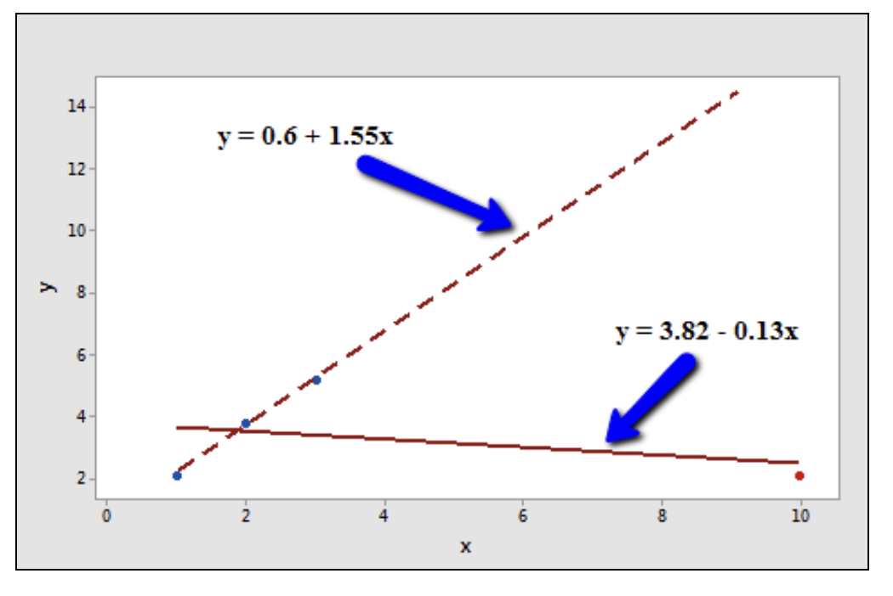

# Studentized Residuals

[Resource](https://online.stat.psu.edu/stat462/node/247/)

When trying to identify outliers, one problem that can arise is when there is a potential outlier that influences the regression model to such and extent that the estimated regression function is "pulled" towards the potential outlier, so that it isn't flagged as an outlier using the standardized residual criterion. To address this issue, studentized residuals offer an alternative criterion for identifying outliers. **The basic idea is to delete the observations one at a time, each time refitting the regression model on the remaining n-1 observations. Then, we compare the observed response values to their fitted values based on the models with the ith observation deleted**. This produces **deleted residuals**. Standardizing the deleted residuals produces studentized residuals.

## Deleted residuals

If we let:
* yi denote the observed response for the ith observation, and
* y hat(i) denote the predicted response for the ith observation based on the estimated model with the ith observation deleted

Then the ith (unstandardized) deleted residual is defined as:

di=yi−ŷ (i)

Data point i being influential implies that the data point "pulls" the estimated regression line towards itself. In that case, the observed response would be close to the predicted response. But, if you removed the influential data point from the data set, then the estimated regression line would "bounce back" away from the observed response, thereby resulting in a large deleted residual. That is, a data point having a large deleted residual suggests that the data point is influential

Consider the plot of n = 4 data points (3 blue and 1 red):



The solid line represents the estimated regression line for all four data points, while the dashed line represents the estimated regression line for the data set containing just the three data points - with the red data point omitted. Observe that, as expected, the red data point "pulls" the estimated regression line towards it. When the red data point is omitted, the estimated regression line "bounces back" away from the point.

However, the question of "how large is large" in terms of the outlier's influence comes into play here. We can solve the problem of answering this question by dividing each deleted residual by an estimate of its standard deviation. That's where studentized residuals come into play.

## Studentized residuals

A studentized residual is simply a deleted residual divided by its estimated standard deviation. This turns out to be equal to the ordinary residual divided by a factor that includes the mean square error based on the estimated model with the ith observation deleted, MSE(i), and the leverage hii.

In general, studentized residuals are going to be more effective for detecting outlying Y observations than standardized residuals. If an observation has a studentized residual that's larger than 3 (in absolute value) we can call it an outlier. The studentized residuals in R are denoted as `TRES`.

## Influence Plots

# Degrees of Freedom

**It's actually pretty simple**. It's how many independent variables of information you needed to make a calculation.

# Analytics Statistics

## t-stat

## Durbin Watson

# Plotting Topics

## Partial Regression Plots

[Refer to this resource](https://www.youtube.com/watch?v=-eLEpMZKNDc)

## CCPR Plots

## Leverage-Resid2 Plot

## Kurtosis

## Influence Plots

# Ridge and Lasso Method with statsmodels

## Method Argument
- `method='elastic_net'` - This is the only real option for ridge/lasso

## Getting Ridge vs Lasso
Control the regularization type using the `L1_wt` parameter:

- **Ridge**: `L1_wt=0`
- **Lasso**: `L1_wt=1`
- **Elastic Net**: `0 < L1_wt < 1`

## Why This Works
Elastic net uses a combined penalty term:

**Penalty = α × [L1_wt × |β| + (1 - L1_wt) × β²]**

Where:
- `L1_wt` controls the mix between L1 (lasso) and L2 (ridge)
- `alpha` controls overall regularization strength

Ridge and lasso are just special cases of elastic net:
- `L1_wt=0` → penalty = β² (L2 only) → Ridge
- `L1_wt=1` → penalty = |β| (L1 only) → Lasso

## Example Usage
```python
# Ridge regression
model.fit_regularized(method='elastic_net', alpha=1.0, L1_wt=0)

# Lasso regression
model.fit_regularized(method='elastic_net', alpha=1.0, L1_wt=1)

# Elastic net
model.fit_regularized(method='elastic_net', alpha=1.0, L1_wt=0.5)
```

# Elastic Net

# TBD
* Confidence Intervals
* Robust Regression to Correct for Outliers
* Leverage